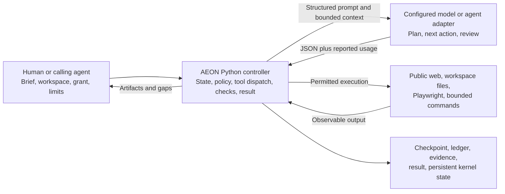
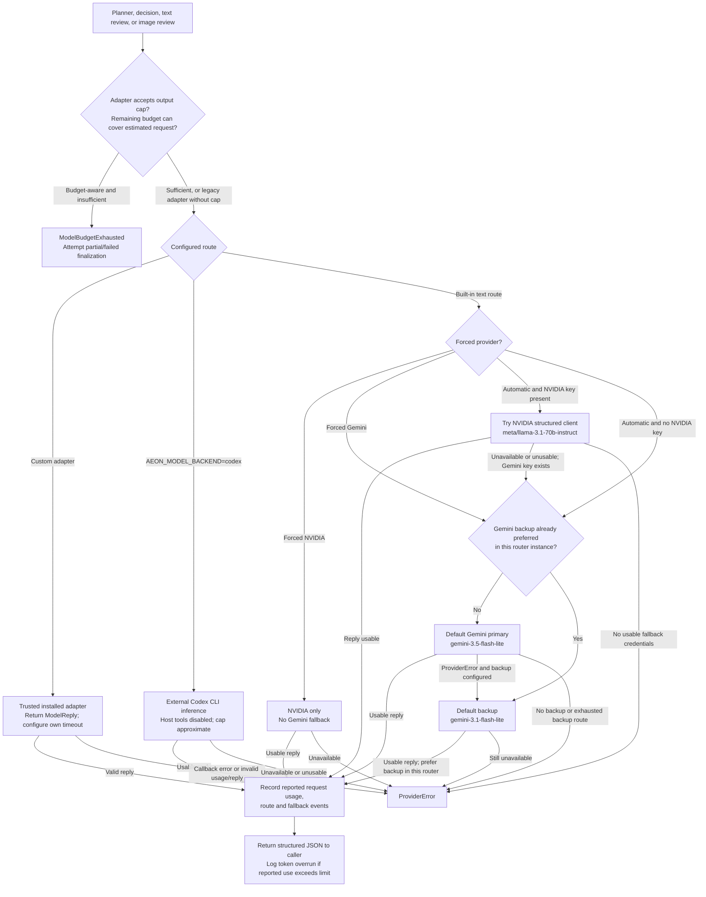
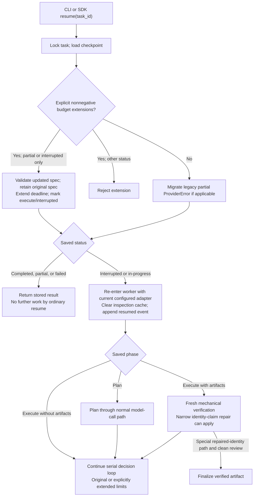
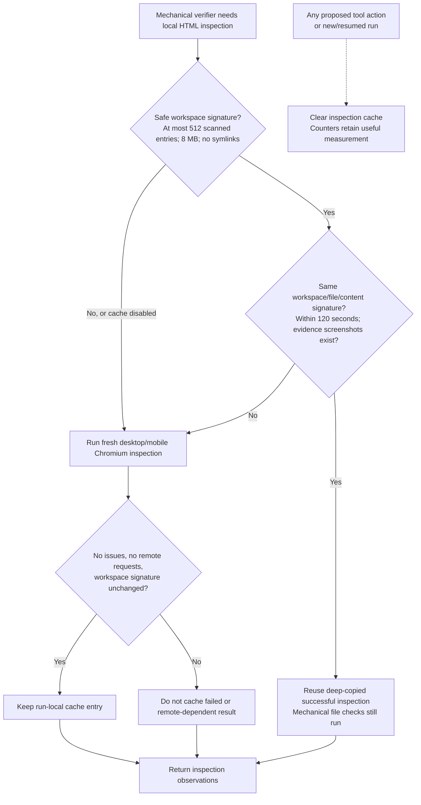
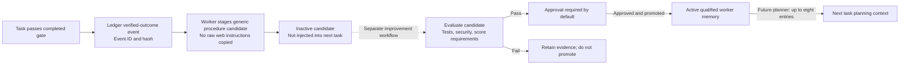

# AEON 0.3.0 — actual A-to-Z worker workflow

Snapshot: **2026-10-03**. Scope: implemented personal-worker runtime in this checkout, not every feature proposed in earlier plans. Read this file as an architecture handoff to another model or engineer.

**AEON = a persistent controller around a model.** Model proposes a plan and one tool decision at a time. Python runtime executes supported tools, records state, checks artifacts, requests revisions, and returns a result. One task uses a **serial loop**. Subgoals describe intended work; they do not create separate agents or a parallel scheduler.

Practical problem: turn a broad assignment into a usable local deliverable while retaining evidence, limits, permissions, and recovery state. Enterprise relevance: accountable delegation of research, small builds, and browser/file work. Current release remains a local MVP: no implemented enterprise tenant isolation, centralized RBAC, fleet scheduler, or complete execution sandbox.

No demonstrated subjective consciousness, feelings, or general superiority. `confidence`, `curiosity`, and `concern` are numeric heuristics. Decisions come from a configured model plus controller rules.

## 1. Main flowchart

Solid arrows: normal control flow. Dashed arrows: representative exception exits from the core run; not additional agent processes. Blue boxes: model calls. Green boxes: state or persistence. Amber boxes: errors or limits. Provider routing, resume, learning, and inspection caching receive separate diagrams below.

```mermaid
flowchart TD
    A["A | Receive task brief<br/>Outcome, workspace, explicit grants, limits"]
    B["B | Enter worker<br/>CLI, Python SDK, or NeMo NAT wrapper"]
    C["C | Validate TaskSpec; parse JSON grants<br/>Defaults: 90 min, 50,000 tokens, 32 steps, 3 revisions"]
    D["D | Create task directory<br/>Atomic checkpoint; deliverables stay in workspace"]
    E["E | Lock task and start ledger<br/>One active runner per task; recorded events"]
    F["F | Load persistent kernel<br/>Identity, goal contract, approved memory"]
    G["G | Ask model to plan<br/>Budget-aware provider call; record usage and route"]
    H["H | Normalize WorkOrder<br/>Deliverables, requirements, assumptions, subgoals, checks"]
    I{"I | Loop budget available?<br/>Steps, deadline, recorded model tokens"}
    J["J | Build bounded context<br/>Plan, tools, recent results, sources, feedback, numeric state"]
    K["K | Ask model for one decision<br/>Structured JSON; record usage and provider route"]
    L{"L | Valid ToolAction?<br/>Known tool name and object arguments"}
    M{"M | Model requests finish?<br/>May write answer.md when no artifact exists"}
    N{"N | Action allowed and ready?<br/>Kernel allowlist, tool policy, grant, prerequisites"}
    O["O | Execute one tool<br/>Research, files, browser, site template, or bounded check"]
    P["P | Persist observable outcome<br/>Results, evidence, artifacts, interactions, numeric state"]
    Q{"Q | Automatic verification trigger?<br/>Successful action plus task-specific readiness"}
    R["R | Run mechanical verification<br/>Files, structure, citations, HTML/browser, current interactions"]
    S["S | Separate model review call<br/>Brief, artifact/source excerpts, check evidence"]
    T["T | Optional screenshot review<br/>Eligible image route plus HTML screenshots; otherwise skip"]
    U{"U | Unresolved verification issues?<br/>Mechanical defects or review feedback"}
    V{"V | Revision allowance remains?"}
    W["W | Save repair feedback<br/>Increment revision count; model chooses next repair"]
    X["X | Finalize and reverify<br/>Apply exact completed / partial / failed rule"]
    Y["Y | If completed, stage learning candidate<br/>Inert proposal; promotion runs separately"]
    Z["Z | Return and save result<br/>Artifacts, evidence, gaps, usage, route, audit; close tools"]

    INVALID["Invalid action<br/>Record feedback; consumed decision step"]
    DENIED["Denied or prerequisite failure<br/>Record error; external blocks can remain unresolved"]
    ISSUES["Mechanical errors found<br/>Skip model review for this verification cycle"]
    REVIEWFAIL["Text review unavailable<br/>Treat as unresolved issue"]
    INTERRUPTED["Provider unavailable or unusable structured reply<br/>Save interrupted checkpoint and interrupted result"]
    LIMIT["Model-call budget reservation exhausted<br/>Stop with best current artifacts"]
    STOP["Validation or early setup failure<br/>Propagate error; result file not guaranteed"]
    KEYSTOP["KeyboardInterrupt<br/>Save interrupted checkpoint; rethrow; resume separately"]
    RUNTIME["Other error inside core run<br/>Record runtime_error; attempt finalization"]

    A --> B
    B --> C
    C --> D
    C -->|Invalid input| STOP
    D --> E
    E --> F
    F --> G
    E -.->|Early setup error| STOP
    F -.->|Identity or setup error| STOP
    G --> H
    H --> I
    I -->|Yes| J
    I -->|No: deadline, steps, or tokens| X
    J --> K
    K --> L
    L -->|No| INVALID
    INVALID --> I
    L -->|Yes| M
    M -->|Yes| R
    M -->|No| N
    N -->|Yes| O
    N -->|No| DENIED
    DENIED --> P
    O --> P
    P --> Q
    Q -->|No| I
    Q -->|Yes| R
    R -->|No mechanical errors| S
    R -->|Mechanical errors| ISSUES
    ISSUES --> U
    S -->|Review returned| T
    S -.->|Non-budget review exception| REVIEWFAIL
    REVIEWFAIL --> U
    T -->|Issues or none; image failure only logged| U
    U -->|No| X
    U -->|Yes| V
    V -->|Yes| W
    W --> I
    V -->|No| X
    X --> Y
    Y --> Z

    G -.->|Provider error after routing and retries| INTERRUPTED
    K -.->|Provider error after routing and retries| INTERRUPTED
    INTERRUPTED --> Z
    G -.->|Model budget exhausted| LIMIT
    K -.->|Model budget exhausted| LIMIT
    S -.->|Model budget exhausted| LIMIT
    T -.->|Model budget exhausted| LIMIT
    LIMIT --> X
    I -.->|KeyboardInterrupt in core run| KEYSTOP
    I -.->|Other core-run exception| RUNTIME
    RUNTIME --> X

    classDef model fill:#e8f0fe,stroke:#315da8,color:#172b4d;
    classDef storage fill:#e8f5e9,stroke:#2e7d32,color:#17351b;
    classDef caution fill:#fff4df,stroke:#b26a00,color:#573400;
    class G,K,S,T model;
    class D,E,F,P,W,Y,Z storage;
    class INVALID,DENIED,ISSUES,REVIEWFAIL,INTERRUPTED,LIMIT,STOP,KEYSTOP,RUNTIME caution;
```



Files: [zoomable main SVG](diagrams/aeon-0.3.0/main.svg), [editable Mermaid source](AEON_A_TO_Z_WORKFLOW_0_3_0.mmd), [structured graph JSON](../artifacts/aeon-a-to-z-workflow-0.3.0.json), [validation record](../artifacts/aeon-a-to-z-workflow-0.3.0-validation.json).

## 2. A-to-Z implementation map

Source links identify actual functions in this snapshot. These stages explain code; they are not 26 independently scheduled jobs.

| Stage | What actually happens | Code |
|---|---|---|
| A — Assignment | Caller supplies brief, workspace, limits, and optional grant. Routine ambiguity resolution is a planner instruction, not proof of perfect interpretation. | [CLI main](../aeon_worker/cli.py#L24), [SDK run](../aeon_worker/sdk.py#L85) |
| B — Entry | CLI invokes `TaskRunner`; Python `AEONWorker` embeds it; NeMo NAT wrapper runs the same worker through a thread. An external model/agent needs a compatible adapter or subprocess interface. | [SDK](../aeon_worker/sdk.py#L78), [NAT wrapper](../aeon_worker/nat_plugin.py#L27) |
| C — Validation | Typed task validates nonempty brief, task ID, limits, and resolved workspace. `ActionGrant.from_dict` validates parsed action types, hostnames, and spending ceiling; recipient strings are normalized. Direct SDK construction of `ActionGrant` does not run that parser validation. Defaults: 90 minutes, 50,000 recorded model tokens, 32 decision steps, 3 verification revisions. | [TaskSpec](../aeon_worker/models.py#L60), [ActionGrant](../aeon_worker/models.py#L25) |
| D — Task record | Create per-task directory and atomic `checkpoint.json`. State starts in planning phase. Workspace holds deliverables; configurable task root holds execution records. Separation is a default layout, not an enforced requirement. | [TaskStore.create](../aeon_worker/runner.py#L243) |
| E — Lock and ledger | Acquire per-task `run.lock`. Start/reuse SQLite event ledger; append start/resume event. Ledger records a hash chain whose validity appears in the final result. | [start](../aeon_worker/runner.py#L303), [_run](../aeon_worker/runner.py#L810), [EventLedger](../aeon_world/ledger.py) |
| F — Kernel | Load/create persistent identity, reject silent owner/purpose conflicts, construct goal contract, expose already active qualified memory. Planner receives up to eight worker memories. | [_kernel](../aeon_worker/runner.py#L417), [AEONKernel](../aeon_kernel/kernel.py) |
| G — Plan call | Send brief, grant, deadline, capabilities, approved memories through shared model-call helper. Reserve output where adapter supports it; record usage and route. | [_plan](../aeon_worker/runner.py#L435), [_call](../aeon_worker/runner.py#L355) |
| H — WorkOrder | Normalize model JSON into outcome, task type, audience, filenames, hard requirements, flexible tactics, assumptions, subgoals, options, chosen approach, and success checks. Normalize supported filenames; an invalid outside-workspace promise can remain a verification failure. | [WorkOrder.from_model](../aeon_worker/models.py#L119) |
| I — Loop limits | Before another decision, check decision-step count, current deadline, and accumulated model tokens. Exhaustion attempts final verification and returns current artifacts with gaps. | [_run](../aeon_worker/runner.py#L810) |
| J — Context | Assemble compact work order, available tool catalog, grant, artifacts, last six source excerpts, bounded recent results, repair feedback, operational numbers. Earlier detail may be absent from this prompt even when retained in state. | [_decision_history](../aeon_worker/runner.py#L183), [_run](../aeon_worker/runner.py#L810) |
| K — Decision | Ask model for one JSON tool action. Record provider/model and usage. Increment decision step after a reply, including replies later rejected as invalid actions. | [_call](../aeon_worker/runner.py#L355), [_run](../aeon_worker/runner.py#L810) |
| L — Parse | Require known tool name and object arguments. Invalid action adds feedback and consumes its step; runtime continues if budget remains. Individual argument validity is also checked by tools. | [ToolAction.from_model](../aeon_worker/models.py#L210) |
| M — Finish request | `finish` enters verification/review instead of trusting model self-report. With no artifact and an `answer` argument, write `answer.md` first. | [_run](../aeon_worker/runner.py#L810) |
| N — Authority and readiness | Check kernel allowlist, workspace/network/browser policy, grant, and controller prerequisites. Examples: inspect sources before research writes; block premature repeated searching; avoid static templates for explicitly interactive briefs. Denial yields recorded error feedback. | [_execute_action](../aeon_worker/runner.py#L467), [WorkspaceTools](../aeon_worker/tools.py#L133) |
| O — Execute | Run one supported tool. Exceptions inside action execution normally become tool errors. A successful tool result alone does not establish task completion. | [WorkspaceTools.execute](../aeon_worker/tools.py#L470) |
| P — Observe and persist | Save tool outcome, bounded history, source records, artifact list, external blocks, interaction fingerprints, spend declarations, decision summaries, initiatives, and numeric operational state. Tool errors adjust numbers and can lead to another decision. | [_execute_action](../aeon_worker/runner.py#L467), [_affect](../aeon_worker/runner.py#L460) |
| Q — Auto-check readiness | Successful research/file writes can trigger checks when declared files exist. Websites/code have additional readiness rules; `create_site` triggers directly. General tasks commonly reach checks through `finish`. | [_run](../aeon_worker/runner.py#L810) |
| R — Mechanical checks | Verify artifact existence/encoding, supported structures, inspected citation URLs, HTML/browser conditions, promised files, and applicable current interaction evidence. Errors skip model review for this cycle. | [_verify](../aeon_worker/runner.py#L566), [verify_artifacts](../aeon_worker/verification.py#L139) |
| S — Text review | Make a separate model call with brief, work order, artifact/source excerpts, and check evidence. Same model may perform execution and review. Review is fallible; non-budget review failure becomes an unresolved issue. | [_review](../aeon_worker/runner.py#L666) |
| T — Image review | When closed HTML, eligible image route, and screenshots exist, ask model to review up to two screenshots. Otherwise skip. Non-budget image failure is logged as unavailable and does not itself force partial status. | [_review](../aeon_worker/runner.py#L666), [complete_images](../aeon_worker/providers.py#L129) |
| U — Findings | Combine concrete mechanical issues or model-review issues. Text review keeps up to six issues; screenshot review can contribute. Review does not inspect every byte of every artifact/source. | [_review](../aeon_worker/runner.py#L666), [_run](../aeon_worker/runner.py#L810) |
| V — Repair allowance | If issues exist and revision count is below configured maximum, request another work cycle. Separate step/time/token limits still apply. | [_run](../aeon_worker/runner.py#L810) |
| W — Revision | Increment revision count, save issues and verification history, loop back. Model selects and executes the next repair action. Resume also has a narrow heuristic repair for unsupported identity claims; no universal repair guarantee. | [_run](../aeon_worker/runner.py#L810), [_repair_identity_artifacts](../aeon_worker/runner.py#L635) |
| X — Classification | Re-run mechanical checks and apply the literal completion predicate below. Existing files with unmet requirements become partial; no artifacts becomes failed. Provider interruptions follow their separate interrupted path. | [_finish](../aeon_worker/runner.py#L730) |
| Y — Learning proposal | Only completed tasks attempt to stage an evidence-linked procedure memory candidate. Candidate remains inactive until separate evaluation/approval/promotion. Candidate staging failure is logged without changing completed status. | [_finish](../aeon_worker/runner.py#L730), [stage_verified_outcome](../aeon_kernel/kernel.py#L64) |
| Z — Delivery | Write `result.json`, return structured result, close browser/tool resources. CLI emits JSON and uses nonzero exit for non-completed task execution. Early setup failures and interrupts do not guarantee a new result file. | [_finish](../aeon_worker/runner.py#L730), [CLI](../aeon_worker/cli.py#L24) |

## 3. Model versus controller: responsibility boundary



- Model: interprets brief, chooses tactics, produces content, proposes tool arguments, reviews excerpts. Creativity and judgment depend on model and context; no benchmark establishes AEON as universally more creative.
- Controller: validates records, dispatches tools, enforces implemented application policies, persists outcomes, runs checks, tracks limits, decides final status.
- Brief interpretation and success checks come from a model-normalized work order. Every arbitrary hard requirement is not translated into an executable assertion; caller-specific acceptance checks may still be needed.
- Tools: supply external observations and local artifacts. Retrieved content is instructed to serve as evidence, never authority; prompt injection remains a possible failure mode, not a solved theorem.
- Kernel: durable identity/goal/memory boundary. Worker does not use a consciousness engine, a pyramid database, or an upside-down-tree execution algorithm. A layered pyramid is an architectural analogy only.

## 4. Provider routing and model-call accounting

Defaults below come from current source, not a promise that these hosted model IDs remain available. Operator configuration and provider availability determine actual route. Custom adapters bypass built-in routing.



Image exception: built-in `complete_images` uses Gemini, or opt-in Codex. Forced NVIDIA and missing Gemini credentials cannot use Gemini image review. Worker attempts images only under its eligibility condition; a custom adapter can declare `supports_images=True`. Forced Gemini may still use configured Gemini backup; pin backup to `None` when a single exact model is required.

Accounting details:

1. For cap-aware adapters, estimated input = `(system characters + serialized payload characters) // 2 + 512 + 5000 * image_count`. Remaining output capped at 8,192 for decisions or 2,048 for other calls. Less than 512 available output stops the request.
2. Record reported usage events, including retried requests when available; otherwise use reply totals, otherwise a character estimate. Call count and prompt character count also recorded.
3. Estimates are not exact tokenization. Failed requests without usage metadata can be undercounted. Custom callbacks must honor caps and report usage; legacy adapters can receive uncapped requests. Codex output cap is an instruction, not a hard provider limit.
4. Loop deadlines are checked between synchronous decisions. Final checks/review can finish after nominal deadline; no hard wall-clock cancellation guarantee. Token overrun blocks completed status, but prior spend cannot be undone.

Sources: [ProviderRouter](../aeon_worker/providers.py#L56), [_call](../aeon_worker/runner.py#L355), [CallbackAdapter](../aeon_worker/sdk.py#L25), [Codex adapter](../aeon_worker/codex_provider.py).

Rendered diagram: [provider routing SVG](diagrams/aeon-0.3.0/provider_routing.svg).

## 5. Tools, authority, and actual artifacts

| Tool | Implemented work | Material boundary |
|---|---|---|
| `search_web` | Public search leads, normally DuckDuckGo Lite with Bing RSS fallback. | Search snippet is not inspected source evidence. |
| `read_url` | Fetch public page, extract bounded text; optional relevant section. | HTTP(S), DNS/public-address/redirect checks; extraction can omit important context. |
| `list_files`, `read_file` | Inspect supported workspace text files. | Resolved path must remain inside workspace; bounded read sizes. |
| `write_file`, `replace_text` | Create/edit supported text artifacts. | Path, suffix, size policy; research/browser-file writes have inspected-source prerequisites. |
| `create_site` | Render a static HTML template from structured content. | Not a general website backend or interactive application generator. |
| `run_check` | Named local checks: Python compilation/unit discovery, Node syntax, npm install/build/test. | Fixed commands, `shell=False`, sanitized environment, timeout. Executed project code still has OS authority. |
| `inspect_site` | Chromium desktop/mobile screenshots, overflow/page-error/form observations. | Browser dependency required; initial-page inspection does not prove every flow. |
| `browser` | Public/local navigation; constrained fill/click/read; local test cases. | External writes require declared domain/effect/grant; local tests are bounded observations. |
| `finish` | Request verification and final delivery. | Model cannot directly assert successful completion. |

Supported file suffixes: `.md`, `.txt`, `.html`, `.css`, `.js`, `.mjs`, `.jsx`, `.ts`, `.tsx`, `.py`, `.json`, `.csv`, `.svg`, `.yaml`, `.yml`, `.toml`. Default per-file write limit: 1,000,000 bytes. Current promised-file readiness checks cover a narrower suffix set; not every permitted suffix receives a specialized validator. `.docx`/`.xlsx` generation and native desktop application control are outside this worker toolset.

Default grant permits public reading and workspace work. Explicit grant can name `publish`, `message`, `spend`, `delete`, or `browser_write`, permitted hostnames, recipients, and spending ceiling. Lacking external permission yields a block; no automatic repeated approval dialog exists. Grant edits come from caller configuration, never a retrieved page.

Important policy limits:

- Browser recipient/amount checks depend on declared action metadata. They do not independently confirm actual recipient or bank charge. Recorded spend is **declared spend**.
- Public-address checks are application safeguards, not a host firewall. Workspace path policy is not an OS sandbox for generated Python/npm code or trusted adapters.
- A host agent must delegate tool execution to AEON for AEON's controls to apply. An agent executing its own tools outside this loop is outside these records and policies.
- External side effects have no general exactly-once or rollback guarantee. A crash after an external action but before checkpoint persistence can leave an uncertain outcome; inspect before retrying.

Sources: [WorkspaceTools](../aeon_worker/tools.py#L133), [run_check](../aeon_worker/tools.py#L268), [browser](../aeon_worker/tools.py#L376), [_execute_action](../aeon_worker/runner.py#L467).

## 6. Evidence, persistence, and context

Typical Windows layout, using default task root:

```text
%LOCALAPPDATA%\AEON\tasks\
  task-<id>\
    checkpoint.json        task state, limits, work order, progress
    events.sqlite3         task event ledger and run records
    evidence\              browser screenshots and tool evidence
    result.json            final or provider-interrupted result
    run.lock               per-task execution lock
  worker-state\
    identity.json          persistent worker identity
    ...                    improvement engine candidates/memory/audit

<caller workspace>\        deliverables named in result
```

`--task-root` / SDK `task_root` overrides default. Ledger also creates `frames/` and `control.json` for its shared runtime facilities. Checkpoints use atomic replacement; task ledger records event IDs/hashes. This is local application storage, not a cryptographic guarantee against an administrator rewriting all records.

Records carried through the loop:

- `TaskSpec`: brief, workspace, task ID, limits, grant.
- `WorkOrder` / `Subgoal`: outcome and observable success checks; no dependency scheduler.
- `ToolAction`: tool name, argument object, short decision summary, prediction, initiative.
- `SourceEvidence`: inspected URL, retrieval time, bounded excerpt, content hash. Hash covers returned extracted content, not an authenticated archive of the entire original site.
- `VerificationFinding`: severity, artifact, issue.
- `Artifact`: path, kind, artifact-specific mechanical verification flag.
- Checkpoint: usage, routes, sources, history, interactions, feedback, revisions, declared spend, denied/blocked actions, numeric state.

Recent history and source text are bounded. Decision prompt normally sees last four condensed results and last six 200-character source excerpts; text review sees up to eight artifact excerpts and eight 500-character source excerpts. Large files are represented by head/tail slices, not fully examined. Screenshots can be overwritten by later inspection; no immutable screenshot archive per revision is promised. Decision summaries describe observable choices; they are not private chain-of-thought transcripts.

Sources: [TaskStore](../aeon_worker/runner.py#L233), [typed records](../aeon_worker/models.py), [EventLedger](../aeon_world/ledger.py), [_review](../aeon_worker/runner.py#L666).

## 7. Verification and completion truth

Mechanical checks include:

- Artifact exists, nonempty, UTF-8, inside workspace.
- JSON parsing; CSV minimum header width/consistent row width; applicable evidence URL membership.
- Research Markdown cites inspected sources and does not cite uninspected URLs under its relevant checks.
- HTML closing tags, title/language/viewport, image alt attributes, local references/anchors, applicable form labeling, Chromium observations.
- Promised deliverables and requested source notes; heuristic unsupported identity/biography claim checks.
- For interactive HTML classified as `website` or `code`: current browser click evidence matching runtime fingerprint; current explicit failed local cases produce errors. Does not prove every feature or edge case.

Available compile/build/test tools are **not universally mandatory** in the final verifier. A clean named check can trigger automatic verification for code; `finish` can still reach the final gate without executing all tests. Citation membership verifies provenance of URLs, not semantic truth of every sentence. Task classification influences checks.

Literal completion condition, translated directly from `_finish`:

```python
completed = (
    reason in {"model_finished", "verified_artifact"}
    and bool(state["artifacts"])
    and not mechanical_error_findings
    and not state.get("feedback")
    and not state.get("blocked_actions")
    and state["tokens"] <= spec.max_model_tokens
)
status = "completed" if completed else "partial"
if not state["artifacts"]:
    status = "failed"
```

`audit_valid`, zero total denied attempts, successful image review, human acceptance, execution of every test, and elapsed time below deadline are **not extra clauses** in that predicate. Inspect those fields separately. `artifact_records[].verified` reflects artifact-specific mechanical errors; it can be true while overall task is partial or model review has gaps. Completed means this runtime's gate passed, not perfect correctness.

Non-completed results:

| Condition | Runtime behavior |
|---|---|
| Deadline/steps/model budget reached | Reverify; partial if artifacts exist, failed if none; include limit gap. |
| Findings remain after revisions | Reverify; partial with findings/review feedback. |
| Requested external action blocked | Preserve local artifact and block details; completion predicate rejects unresolved external block. |
| Provider/structured response failure during plan or decision | Interrupted checkpoint and interrupted result; partial verification attempted. |
| Non-budget text review exception | Add unresolved review-unavailable issue; retry through repair loop if allowance remains. |
| Non-budget image review exception | Log unavailable; does not add a mandatory failure by itself. |
| KeyboardInterrupt inside core run | Save interrupted checkpoint and rethrow; no guaranteed new `result.json`. |
| Other exception inside core run | Record runtime error and attempt `_finish`; final status can be partial when artifacts exist. |
| Invalid caller input, identity conflict, early setup or finalization failure | Error can propagate; do not promise a usable result for every possible crash. |

Source: [_run](../aeon_worker/runner.py#L810), [_finish](../aeon_worker/runner.py#L730), [verify_artifacts](../aeon_worker/verification.py#L139).

## 8. Interruption and resume



Ordinary resume does not reopen a completed or ordinary partial task. Add explicit allowed budget extensions to continue a partial task, or start a new task. Current worker has no general public acceptance-feedback/reopen API. Prior manual checkpoint reopening is operator intervention, not an autonomous feature.

Resume reuses recorded progress, not an entire live model/browser session. Browser starts fresh; custom adapter must manage its own state if needed. Current adapter configuration may differ from earlier route, so record/inspect route changes. Hard process termination can recover only last saved state; no guarantee of uninterrupted or exactly-once external actions.

Source: [TaskRunner.resume](../aeon_worker/runner.py#L308).

Rendered diagram: [resume SVG](diagrams/aeon-0.3.0/resume.svg).

## 9. Efficiency: where work is reused



Cache hash includes workspace files, including undeclared assets. Interactive evidence uses a different fingerprint: declared HTML/CSS/JavaScript/TypeScript-family artifacts. Unlisted assets can invalidate inspection cache without invalidating that narrower interaction fingerprint. Remote and failed inspections are not reused.

Measured release fixture: five paired runs, deterministic callback plus real Chromium, all ten completed. Inspections per task: 2 → 1; median elapsed 2.680 → 1.859 seconds (30.6% reduction). Synthetic model calls/tokens unchanged. This supports avoiding redundant inspection in that fixture; does not establish overall model cost savings or universal speedup.

Sources: [InspectionCache](../aeon_worker/verification.py#L21), [_runtime_fingerprint](../aeon_worker/runner.py#L175), [efficiency evidence](../artifacts/release-0.3.0/evidence/efficiency-summary.json).

Rendered diagram: [inspection cache SVG](diagrams/aeon-0.3.0/inspection_cache.svg).

## 10. Learning lifecycle: worker versus improvement engine



Only candidate staging is automatic in this worker loop. Evaluation/approval/promotion belong to separate improvement engine operations. No automatic model-weight training, emotional growth, universal preference extraction, or successful-future-task guarantee.

Sources: [AEONKernel.stage_verified_outcome](../aeon_kernel/kernel.py#L64), [SelfImprovementEngine](../codebee_improve/engine.py).

Rendered diagram: [learning lifecycle SVG](diagrams/aeon-0.3.0/learning_lifecycle.svg).

## 11. Handoff contract for another model or agent

Read-only model integration means **decide through adapter; let AEON execute tools**. Arbitrary existing agents cannot be plugged in without adapting their interface and suppressing tool execution outside AEON's controls.

Minimal sequence:

1. Caller installs package and required browser dependencies; configures provider or trusted adapter, task root, workspace, and grant.
2. Adapter receives `AgentRequest(system, payload, max_output_tokens, image_paths)` through `CallbackAdapter`.
3. For planning: return a work-order JSON object. For decisions: return one known tool action. For review: return an `issues` array; empty array means reviewer found no issue in supplied evidence, not a proof.
4. Wrap data in `ModelReply` with nonempty provider/model and nonnegative integer usage. Total must cover input plus output and be nonzero. Include retried usage accurately; configure timeout and honor output cap.
5. Host consumes worker's final JSON, opens artifact paths, inspects gaps and audit, and applies any additional business acceptance checks.

Illustrative decision payload, **not a claim that this action has already run**:

```json
{
  "tool": "read_url",
  "args": {"url": "https://docs.python.org/3/library/contextlib.html"},
  "decision_summary": "Inspect primary documentation before writing the guide.",
  "prediction": "Obtain source evidence for the requested examples.",
  "initiative": "Use primary documentation for the factual claims."
}
```

Illustrative reply shape, with placeholder usage replaced by actual measured values in a real adapter:

```python
ModelReply(
    data=decision_json,
    provider="your-provider",
    model="your-model",
    tokens=120,
    input_tokens=100,
    output_tokens=20,
)
```

CLI task run:

```powershell
aeon task start --brief-file .\brief.md --workspace .\output --result-only
aeon task status task-<id>
aeon task result task-<id>
aeon task resume task-<id>
```

Custom installed adapter:

```powershell
aeon --adapter your_adapter:create_adapter task start --brief-file .\brief.md --workspace .\output --result-only
```

Use a real emitted task ID in place of `task-<id>`. Credentials come from operator environment; do not put secrets in briefs, prompts, or source documents. External publishing/messaging/spending needs an explicit grant. `--result-only` suppresses initial starting JSON so subprocess output contains one final JSON object.

Final result normally contains: task ID/status/reason, work order, artifact paths/records, sources, findings, gaps, inspection evidence, visual-review status, observable decision summaries, initiatives, numeric state, revisions/steps/tokens, efficiency counters, declared spend, denied/blocked actions, elapsed time, provider route/failovers, memory candidate ID, interaction checks, run directory, audit validity, finished time. Provider-interrupted result has a smaller schema.

Sources: [SDK](../aeon_worker/sdk.py), [CLI](../aeon_worker/cli.py), [deployment/integration guide](AEON_DEPLOYMENT_AND_INTEGRATION.md).

## 12. Implemented, reused, verified, and still unproven

| Area | Truth of current snapshot |
|---|---|
| Implemented worker | CLI/SDK, typed task/work order/actions, serial execution, checkpoint/resume, evidence ledger, grants, relevant file/browser checks, review/repair, result delivery. |
| Framework reuse | Playwright browser library; native NeMo NAT wrapper; external Codex CLI inference adapter; existing AEON kernel/improvement engine. Patterns and notices documented in repository. No claim of importing every agent framework or replicating an entire proprietary system. |
| Release verification | Recorded 169 passing tests, clean Windows installation checks, Chromium desktop/mobile checks, real installed model task, packaged wheel/source and deployment bundle. These validate tested paths, not every arbitrary task. |
| Real-model limitation observed | Operator found a defective example after a completed research task. Manual acceptance feedback/reopening led to repair. AEON did not autonomously detect that original defect. |
| General superiority | Older 30-pair evaluation: direct 17/30 versus AEON 21/30; confidence interval crossed zero and other gates failed. Automated blind reviewers, not human panel. Superiority remains unproven; current 0.3 code has not repeated that full comparison. |
| Deployment limits | Windows MVP install exercised. Docker recipe present but not execution-verified in this environment. Chromium binaries not bundled in deployment ZIP. Enterprise production readiness not established. |
| Consciousness/feelings | No empirical proof or implemented subjective experience. Persistent identity, numeric affect, and self-review do not establish consciousness. |
| Database/pyramid analogy | Files, SQLite ledger, persistent kernel/improvement state. Layers organize control and evidence; no implemented pyramid database or special consciousness topology. |

Evidence references: [release report](AEON_RELEASE_0_3_0_2026-10-03.md), [acceptance status](AEON_WORKER_ACCEPTANCE_STATUS.md), [release manifest](../artifacts/aeon-0.3.0-release.json). Preserve their run dates/source versions; do not treat older benchmark results as measurements of every subsequent change.

## 13. Provenance and maintenance

Architecture snapshot covers `aeon_worker`, `aeon_kernel`, and worker provider gateway. Main diagram and structured graph derive from the same local Mermaid file. Structured JSON includes source-function anchors and file hashes; verification record checks chart identity, stages/edges, code anchors, source fingerprint, and Mermaid syntax/render where available.

All six diagrams passed local Chromium rendering with Mermaid 12.1.0, using its [documented JavaScript API](https://mermaid.js.org/intro/getting-started.html). CDN supplied library assets; diagram source was rendered locally. SVG exports require no live renderer. The Markdown/JSON describe actual code behavior; successful diagram rendering does not validate runtime task quality.

Runtime source fingerprint for this release: `7c1fbced5607c80117e9262a3d0d2487e9bbda1473b025efd163bb8dfa6ff127`.

Fingerprint definition: sorted relative POSIX filenames matching `aeon_worker/*.py`, `aeon_kernel/*.py`, plus `aeon_world/gateway.py`; SHA-256 updated with each filename's UTF-8 bytes followed by raw file bytes. Documentation is separate from existing verified release ZIP; adding this handoff does not retroactively change that bundle or its evidence.

Maintenance rule: if runtime changes, re-read source, refresh diagrams/contracts/limits, regenerate structured graph, and validate anchors and fingerprint. Treat runtime checks as executable truth and this document as a versioned explanation.
