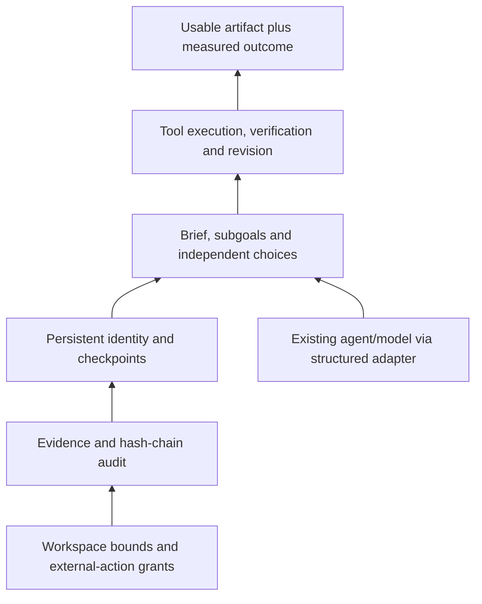

# AEON 0.3: install, run, integrate

AEON is a local, CLI-first worker framework. Give it a brief and a workspace;
it plans, executes bounded tools, verifies artifacts, revises defects and saves
a result plus an audit trail. The package also exposes a Python SDK so another
agent can supply decisions while AEON manages the work loop.

**Readiness boundary:** supported personal-worker MVP, not a hosted multi-tenant
enterprise service. Windows wheel installation is tested. Container files are
provided; Docker is unavailable on the development host, so container execution
is not yet verified. Existing employee-performance superiority remains unproven.
Behavioral state is not evidence of feelings or consciousness.

## Install the release

For the extracted Windows release bundle, use the supplied installer:

```powershell
.\deployment\install.ps1 -PythonExecutable "C:\path\to\python.exe"
```

It creates `.aeon-venv`, installs the wheel/dependencies/Chromium, runs smoke and
prints the CLI path. Optional `-Probe` verifies your configured real provider.
`-Offline` uses bundled Windows x64 Python 3.11 dependency wheels and requires
matching Chromium already cached. Browser binaries are not in the bundle.
Other platforms/Python versions use the online installation below.

Python 3.11 or newer. From an extracted source release:

```powershell
py -3.11 -m venv .aeon-venv
.\.aeon-venv\Scripts\python.exe -m pip install -c deployment\requirements.txt ".[deployment]"
.\.aeon-venv\Scripts\python.exe -m playwright install chromium
.\.aeon-venv\Scripts\aeon.exe doctor
.\.aeon-venv\Scripts\aeon.exe smoke --workspace .\smoke-output
```

Or install the prebuilt wheel in a new virtual environment:

```powershell
.\.aeon-venv\Scripts\python.exe -m pip install -c deployment\requirements.txt ".\codebee_improve-0.3.0-py3-none-any.whl[deployment]"
.\.aeon-venv\Scripts\python.exe -m playwright install chromium
```

Distribution name remains `codebee-improve` for compatibility; command is `aeon`,
Python import is `aeon_worker`. Core installation has no third-party dependency.
Browser tasks need the deployment extra and downloaded Chromium. No simulator,
Codex CLI or NVIDIA NeMo Agent Toolkit is required for ordinary worker tasks.

The credential-free `smoke` command writes checked JSON and validates the audit.
Its callback is deterministic: it does not test AI quality and its accounting
values are synthetic. `doctor --probe` makes a real provider request.

## Run a real task

Set an existing credential in the shell (do not paste keys into briefs or files):

```powershell
# Set NVIDIA_API_KEY or GEMINI_API_KEY using your normal secret manager/shell.
.\.aeon-venv\Scripts\aeon.exe doctor --probe
.\.aeon-venv\Scripts\aeon.exe task start --brief "Research Python ExitStack from official documentation; write a short cited guide.md." --workspace .\my-work
```

NVIDIA is primary; Gemini is fallback. Current model routes and every switch
appear in the result. Codex is an optional separately installed inference
backend via `AEON_MODEL_BACKEND=codex`; it does not receive AEON tool authority.
See `AEON_WORKER_MVP_IMPLEMENTATION.md` for provider and grant configuration.

```powershell
aeon task status task-RETURNED_ID
aeon task result task-RETURNED_ID
aeon task resume task-RETURNED_ID
```

Default limits: 90 minutes, 50,000 model tokens, 32 tool steps, 3 revision cycles.
Limits can be changed explicitly at start or extended on resume. Results report
completed/partial/interrupted/failed, verified artifacts, gaps, sources, usage,
route, time, decision summaries and audit validity. A provider failure preserves
the checkpoint; do not start a second copy to resume the first.

Checkpoints live outside the workspace under `%LOCALAPPDATA%\AEON\tasks` on
Windows. Override with global `--task-root PATH`, before the subcommand. Back
up both that directory (including worker-state) and the workspace. Do not share
an active task ID between workers. Independent task directories have locks.
Use a separate AEONWorker instance and adapter for each concurrent task.

## Architecture / capability pyramid



Authority and evidence support every higher layer. Successful outcomes stage
learning candidates; candidates do not automatically change trusted memory.
The planner and reviewer are separate calls; they may use the same underlying
model. Mechanical and browser checks are independent of its self-report.

## Embed AEON in another agent

There are two integration modes. Delegate an entire assignment through the CLI
from any language/framework, or embed the Python SDK and supply your own decision
engine. CLI delegation needs no custom Python adapter:

```powershell
aeon task start --result-only --brief-file brief.md --workspace .\deliverables
```

`--result-only` emits one JSON object; a subprocess tool can decode it directly.
Exit code 0 means completed, 1 means a partial/interrupted/failed result, 2 means
invalid CLI input. Start blocks while the worker runs; background it and poll
`task status` if your orchestrator needs asynchronous jobs. Other agent actions
outside that subprocess remain governed by the host agent's own authority.

Native Python application, orchestrator or graph node:

```python
from aeon_worker import AEONWorker

worker = AEONWorker(task_root="./aeon-state")  # existing NVIDIA/Gemini route
result = worker.run(
    "Build an offline discount calculator with boundary validation.",
    workspace="./deliverables",
)
print(result["status"], result["artifacts"], result["unresolved_gaps"])
```

For an existing decision engine, wrap its model call:

```python
from aeon_worker import AEONWorker, AgentRequest, CallbackAdapter, ModelReply

def decide(request: AgentRequest) -> ModelReply:
    # Implement this method using your agent's existing model client.
    # The client must return a decoded JSON object and accurate usage.
    response = existing_agent.decide_json(
        system=request.system,
        payload=request.payload,
        max_output_tokens=request.max_output_tokens,
        timeout_seconds=60,
    )
    return ModelReply(
        data=response.json_object,
        provider=response.provider,
        model=response.model,
        tokens=response.total_tokens,
        input_tokens=response.input_tokens,
        output_tokens=response.output_tokens,
    )

worker = AEONWorker(adapter=CallbackAdapter(decide), task_root="./aeon-state")
result = worker.run("Your brief", "./deliverables")
```

`existing_agent.decide_json` is an integration placeholder, not a claimed method
on every framework. Adapt it to your client. An executable, credential-free
example is in `examples/agent_integration.py`.

Contract:

| Request/response | Requirement |
|---|---|
| Planner | Return outcome, task_type, deliverables, requirements, subgoals, success_checks, approach |
| Tool decision | Return `{"tool": "write_file", "args": {"path": "answer.md", "content": "..."}, "decision_summary": "short observable choice"}` |
| Reviewer | Return `{"issues": []}` or concrete defect strings |
| Finish | Return `{"tool": "finish", "args": {}}` |
| Usage | Actual nonnegative integer totals; total >= input + output; include retries and billed reasoning where reported |
| Limits | Honor max_output_tokens; bound network time; return structured output rather than prose |
| Images | Optional `CallbackAdapter(decide, supports_images=True)`; consume request.image_paths |
| Authority | Callback supplies decisions; AEON executes its own tools and enforces grants |

Capabilities and schemas accompany each request. Python callbacks are trusted
operator code and can technically execute arbitrary code: AEON does not sandbox
the callback. Do not give an upstream autonomous agent unrestricted tools while
claiming AEON grants control its actions. Custom adapters must be decision-only.

Synchronous contract; use a background worker/thread when calling from an async
host. Do not invoke the synchronous Playwright worker directly inside a running
async event loop. Different Python environments can communicate using their own
JSON/RPC bridge implementing the same contract; no network server is shipped.

CLI adapter: put a factory returning `CallbackAdapter` in an installed module:

```powershell
aeon --adapter my_agent_adapter:create_adapter task start --brief-file brief.md --workspace .\deliverables
```

The reference is explicit operator configuration, never model/page content.
Factories must be available in the installed environment. Reuse the same adapter
when resuming. Custom adapter loading is not currently exposed by the benchmark
CLI; use its Python `provider_factory` parameter for matching both arms.

This works with decision-capable agents through a small adapter; it is not
zero-configuration support for literally every agent. NVIDIA NeMo Agent Toolkit
integration already has a native plugin:

```powershell
python -m pip install ".[nat]"
nat run --config_file configs\aeon-nat-workflow.yml --input "Your brief"
```

## Efficiency behavior

- Recent tool output is bounded; generated file bodies stay out of repeated
  decision context. Excerpts retain useful beginnings/endings without overlap.
- Browser test cases batch up to 12 cases per tool action.
- Successful local previews reuse screenshots within the same run/verification
  cycle; all workspace file bytes participate in invalidation, including assets
  omitted from declared deliverables.
- Changed files, missing screenshots, elapsed 120-second TTL, tool actions,
  resumed runs, failed inspections or remote HTTP resources require fresh checks.
- Workspaces exceeding 512 enumerated entries or 8 MB bypass caching. Mechanical
  checks and model review still execute; there is no cached claim of task success.
- Budget-aware adapters receive a maximum output reservation before requests.
  Estimated input reservation is conservative, not an exact tokenizer. Reported
  overruns prevent completion. Limits are checked between synchronous calls;
  callbacks must honor request limits and configure their own timeout.
- Results include model call count, prompt character count, verification browser
  inspections and inspection cache hits. Legacy callbacks without a budget
  keyword remain supported but should migrate to CallbackAdapter.

## Container worker

Container is an optional single-owner job runner, not a public HTTP application:

```powershell
Set-Location deployment
docker compose build
docker compose run --rm aeon doctor --probe
docker compose run --rm aeon smoke --workspace /work/smoke
docker compose run --rm aeon task start --brief "Write a researched guide.md with official source links" --workspace /work/guide
```

Named volumes retain `/data/tasks` and `/work`; copy deliverables with
`docker compose ... cp`. Supply brief/grant files using an explicit mounted
directory if needed. Never mount the entire home directory or Docker socket.
The image runs as `pwuser`, enables Chromium sandboxing, uses the upstream
seccomp profile and does not expose a port. Host must support user namespaces.
Do not switch to root/disable sandbox to conceal a failing deployment check.

Playwright package and browser image are both pinned to 1.63.0. Worker dependency
versions are in `deployment/requirements.txt`. Source packaging excludes keys,
personal checkpoints and benchmark artifacts; release archives carry licenses.

Container guidance follows [Playwright Docker documentation](https://playwright.dev/python/docs/docker)
and its [sandbox launch option](https://playwright.dev/python/docs/api/class-browsertype#browser-type-launch-option-chromium-sandbox).
Build/install artifacts follow the [Python Packaging guide](https://packaging.python.org/en/latest/tutorials/packaging-projects/).

## Operational scope

Use a dedicated OS account or container for generated-code tasks. Workspace path
checks and grants are application controls, not an OS sandbox for generated
Python/npm code. Run-check subprocesses strip credentials; code still inherits
the user's filesystem authority. Container volumes limit exposure, but this
release has not been assessed as an adversarial-code execution service.

Public read + workspace edits need no special grant. Publishing, messaging,
spending or remote mutations require an explicit grant with domain/action/
recipient/ceiling. Missing authority produces a checked draft plus blocked gap.
Native desktop control and DOCX/XLSX generation remain outside this MVP.

For an enterprise deployment, add authenticated job admission, per-user isolation,
tenant storage/retention, network policy, secret management, operational metrics
and independent security/load assessment before exposing it to other users.
This release provides the reusable worker foundation and local deployment path.
