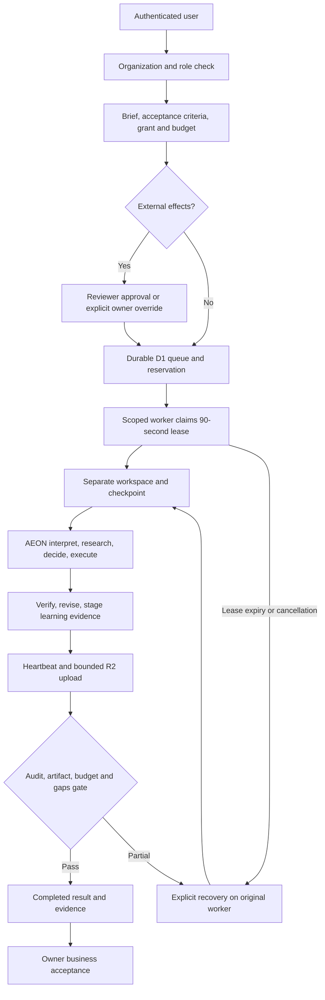

# AEON Enterprise 0.4.0 — deployment and operations

## Release boundary

Hosted organizational controls around the working AEON runtime. Initial deployment
supports an owner-private enterprise pilot. No claim of compliance certification,
consciousness, universal agent compatibility or proven superiority.



## Worker setup

Python 3.11+, Chromium and a model credential:

```powershell
python -m pip install '.[deployment]'
python -m playwright install chromium
```

Enroll via **Workers**, download connection JSON outside the checkout and restrict
filesystem access. Set `NVIDIA_API_KEY` or `GEMINI_API_KEY`. NVIDIA is primary with
Gemini fallback; evidence records switches and usage. Secrets never belong in Git.

For organizational jobs use a supervisor host with Docker CLI/daemon:

```powershell
docker build -f deployment/enterprise-worker.Dockerfile -t aeon-enterprise-worker:0.4.0 .
aeon-enterprise-worker --connection C:\AEON-private\worker-connection.json --state-root C:\AEON-private\jobs
```

Each container receives only its job directory. Jobs use a non-root image user,
read-only filesystem, dropped capabilities and resource limits. Configure Linux
job-directory ownership for `pwuser`. Never mount the Docker socket into a job.
Container networking permits provider/web access; no egress proxy exists yet.
Docker execution is implemented but unverified on the current machine, which lacks
a Docker daemon.

For your owner-private tasks, explicitly enroll **trusted-local** mode:

```powershell
aeon-enterprise-worker --connection C:\AEON-private\worker-connection.json --state-root C:\AEON-private\jobs --trusted-local
```

Trusted-local execution has the worker account's operating-system permissions; tool
policy is not an OS sandbox. Never use it for untrusted tenant briefs. Neither mode
silently falls back. The console stays hosted while workers are offline; queued jobs
wait. A local worker needs its computer awake, online and its process running.

Windows helpers start the supervisor hidden and optionally enable current-user login
startup. No administrator privileges or startup credential values are required:

```powershell
.\deployment\start-enterprise-worker.ps1 -Python .\.venv\Scripts\python.exe
.\deployment\install-enterprise-autostart.ps1 -Python .\.venv\Scripts\python.exe
```

The pilot uses `%LOCALAPPDATA%\AEON\enterprise-private\` for protected connection,
provider keys, job state and logs. Login startup launches the same installation.
Remove `AEON Enterprise Worker.vbs` from the current user's Startup folder to disable
automatic launch. Windows Script Host must be permitted by device policy; actual
logout/restart behavior has not been tested in this session. Keep repository/venv paths
stable or reinstall the startup launcher after moving them.

## Authority

| Role | Actions |
|---|---|
| Owner | Delegate, approve, recover, cancel, workers, team, export |
| Operator | Delegate, recover, cancel |
| Reviewer | Read and approve scoped external requests |
| Viewer | Read workspace and artifacts |

Both organization membership and hosting audience restrictions apply. Invitations
do not expand Site audience. Team rollout needs separate hosting access configuration.
Initial owner bootstrap checks configured email. Worker credentials cannot create
grants, approve tasks or manage tenants.

Default grant permits public reading and job files. External writes/publishing,
messaging, deletion and spending need expressly named actions, domains/recipients and
limits, then approval. Self-approval requires explicit owner override and a reason.
Spending is disabled here. Retrieved pages provide evidence, never instructions.

## Limits

Defaults: 25 jobs and 1,000,000 reserved/used tokens per UTC day; 50,000 tokens per
task. Task defaults: 20,000 tokens, 30 minutes, 32 steps, 3 revisions. Tokens measure
model usage, not currency cost. Provider/source errors may yield honest partial results.
Cancelled jobs conservatively retain their token reservation until the UTC daily reset,
because rejected leases cannot reliably report final model usage.

Artifacts: supported open formats, 8 MB/file, 32 MB/job, 64 records. Paths reject
traversal. Downloads use attachment/octet-stream and sandbox headers; generated HTML
never runs on the console origin. R2 hashes permit independent byte verification.
Failed metadata commits may leave unreferenced R2 objects; cleanup is not automated.

## Recovery and operations

- Heartbeats every 20 seconds renew a 90-second lease. Claims are atomic.
- Cancellation clears the lease; supervisor stops after next rejected heartbeat.
  It does not roll back previous external effects.
- Expiry marks interrupted work. Resume requires explicit limits and original worker
  checkpoint. Preserve state and identity. No exactly-once external-effect guarantee.
- Identical final-result retries with the same lease are idempotent.
- Revoke compromised worker via console. Rotate deployment/service keys through Sites
  runtime settings and redeploy; replace affected connection files.
- Export organization records and download artifact bundles. Exports are not a tested
  database disaster-recovery procedure. Encrypt worker-state backups and test restore
  separately. Retention/deletion, restore automation and recovery objectives remain open.
- Monitor logs, task gaps, offline indicators and authorized `/api/health`. No on-call
  alerting service or SLA exists in this release.
- Runtime ledger verifies a hash chain. Control-plane audit is append-only via API,
  but database administrators can edit it; no externally signed compliance evidence.

## Rollout gates still open

Customer SAML/OIDC/SCIM, automated provisioning, untrusted-tenant sandbox validation,
provider-key vault/proxy, adversarial/load testing, verified restore, retention controls,
independent security review and operational SLOs precede a broad or regulated rollout.
Private pilot demonstrates the complete task-to-artifact path.

## Verification

Root: `python -m unittest discover -s tests`. Enterprise: `npm test`, `npm run build`,
`npm run validate`. Local UI: `python enterprise/tests/browser_verify.py` with preview
running. CI covers Python and Node checks. Live evidence is recorded after deployment.

Architecture uses Hono, Zod, Drizzle, Cloudflare D1/R2 and Playwright around AEON.
Existing Codex/NVIDIA provenance remains in `THIRD_PARTY_NOTICES.md`; no proprietary
hosted agent internals are copied.
